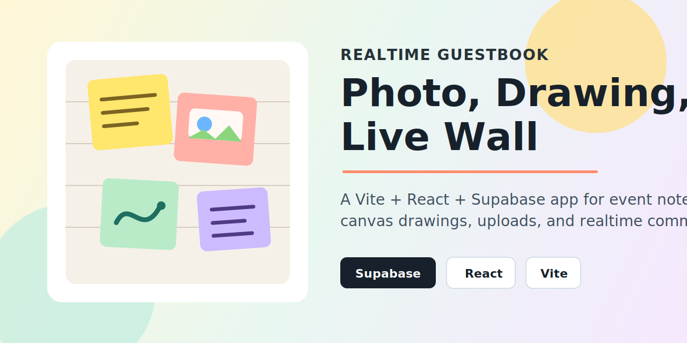

# Realtime Guestbook



Realtime Guestbook은 방문자가 사진을 업로드하거나 캔버스에 직접 그림을 그려 방명록을 남기고, 다른 방문자들이 `/wall`에서 포스트잇 형태로 실시간 확인할 수 있는 디지털 방명록 웹 앱입니다.

## 프로젝트 목적

행사, 전시, 모임, 클래스처럼 현장에서 여러 사람이 짧은 메시지와 이미지를 남기는 상황을 위해 만들었습니다. 단순한 입력 폼이 아니라 사진, 드로잉, 실시간 벽, 댓글 흐름을 한 번에 제공하는 MVP입니다.

## 주요 기능

- 사진 업로드 또는 캔버스 드로잉으로 방명록 작성
- 이름 또는 닉네임과 짧은 메시지 입력
- Supabase Storage에 이미지 저장
- `guestbook` 테이블에 방명록 post 저장
- `/wall`에서 포스트잇 카드 형태로 방명록 표시
- Supabase Realtime 기반 새 방명록 실시간 반영
- 방명록 상세 모달과 실시간 댓글 스레드
- 모바일/데스크톱 반응형 레이아웃
- 입력 검증, 로딩 상태, 오류 메시지, 모달 Escape 닫기 지원

## 사용 기술

- React 19
- TypeScript
- Vite
- React Router
- Supabase Postgres
- Supabase Storage
- Supabase Realtime
- Vitest
- ESLint

## 프로젝트 구조

```text
src/
  components/
    DrawingCanvas.tsx
    PhotoUploader.tsx
    PostDetailModal.tsx
    PostItCard.tsx
  lib/
    guestbook.ts
    supabase.ts
    upload.ts
  pages/
    HomePage.tsx
    WallPage.tsx
  types.ts
supabase/
  schema.sql
memory-bank/
  architecture.md
  implementation-plan.md
  progress.md
docs/
  thumbnail.svg
```

## 실행 방법

의존성을 설치합니다.

```powershell
npm install
```

환경 변수 파일을 만듭니다.

```powershell
Copy-Item .env.example .env.local
```

`.env.local`에 Supabase 값을 입력합니다.

```env
VITE_SUPABASE_URL=https://your-project-ref.supabase.co
VITE_SUPABASE_ANON_KEY=your-supabase-anon-key
```

`VITE_SUPABASE_URL`에는 `/rest/v1` 같은 경로를 붙이지 말고 Supabase 프로젝트 루트 URL만 입력해야 합니다.

개발 서버를 실행합니다.

```powershell
npm run dev
```

## Supabase 설정

Supabase SQL Editor에서 [supabase/schema.sql](supabase/schema.sql)을 실행합니다.

이 스키마는 다음 작업을 수행합니다.

- 기존 `public.guestbook` 테이블 확장
- `public.comments` 테이블 생성 또는 보정
- `guestbook.created_at`, `comments(post_id, created_at)` 인덱스 생성
- MVP용 공개 read/insert RLS 정책 생성
- `guestbook-media` public Storage bucket 생성
- `posts/` 경로에 대한 anon upload/read 정책 생성
- `guestbook`, `comments` Realtime publication 활성화

앱이 기대하는 주요 테이블은 다음과 같습니다.

| 테이블 | 용도 |
| --- | --- |
| `guestbook` | 방명록 post 저장 |
| `comments` | 방명록별 댓글 저장 |

이미지는 `guestbook-media` 버킷의 `posts/photos/` 또는 `posts/drawings/` 하위 경로에 저장됩니다.

## 명령어

```powershell
npm run dev
npm test
npm run lint
npm run build
npm run preview
```

## Vercel 배포

GitHub 저장소를 Vercel에 연결해서 배포하는 방식을 권장합니다.

1. Vercel에서 **Add New Project**를 선택합니다.
2. GitHub 저장소 `zxcc9867/reailtime-guestbook`을 import합니다.
3. Framework Preset은 **Vite**로 둡니다.
4. Build Command는 `npm run build`를 사용합니다.
5. Output Directory는 `dist`를 사용합니다.
6. Environment Variables에 다음 값을 추가합니다.
   - `VITE_SUPABASE_URL`
   - `VITE_SUPABASE_ANON_KEY`
7. Deploy를 실행합니다.

CLI로 배포하려면 Vercel CLI 로그인 후 아래 명령을 사용할 수 있습니다.

```powershell
npm install -g vercel
vercel
vercel --prod
```

Vercel에서도 Supabase 환경 변수는 반드시 프로젝트 설정에 등록해야 합니다.

## 검증

현재 확인한 검증 명령은 다음과 같습니다.

```powershell
npm test
npm run lint
npm run build
```

추가로 브라우저에서 아래 흐름을 수동 확인하는 것이 좋습니다.

- 텍스트만 있는 방명록 작성
- 사진 방명록 작성
- 드로잉 방명록 작성
- 두 브라우저 탭에서 `/wall` 실시간 반영 확인
- 상세 모달에서 댓글 실시간 반영 확인

## 보안 메모

MVP는 익명 공개 작성 모델입니다. 공개 행사나 실제 서비스에 연결하기 전에는 rate limiting, moderation, 더 엄격한 Storage 정책, 스팸 방지 전략을 추가하는 것이 좋습니다.
