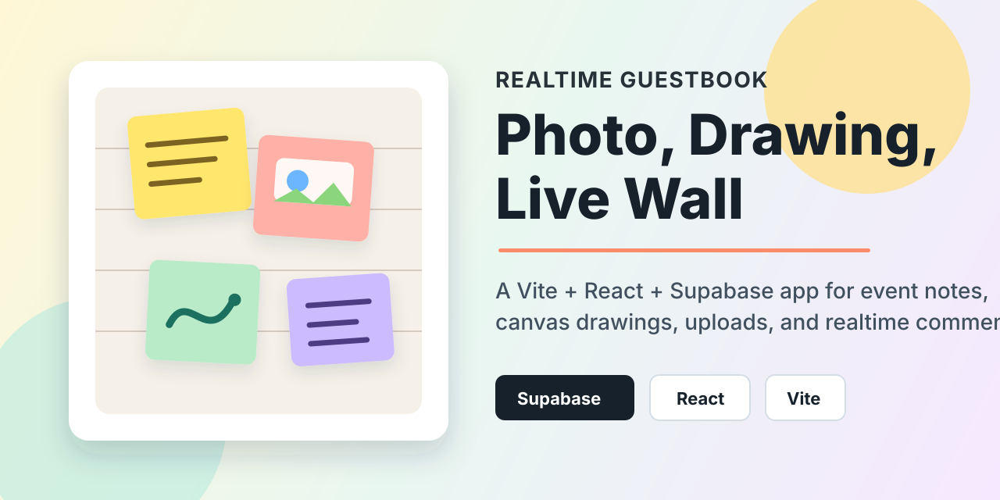
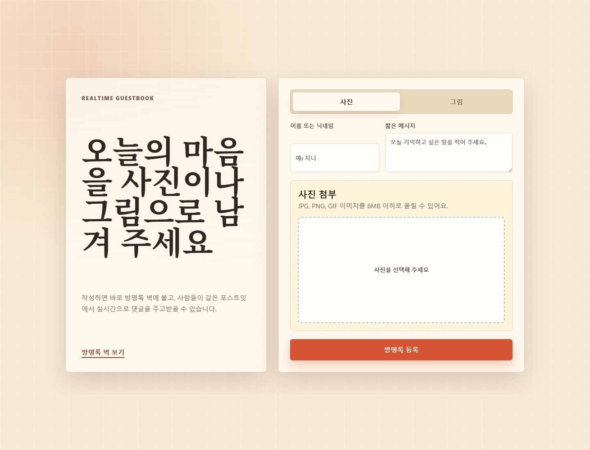
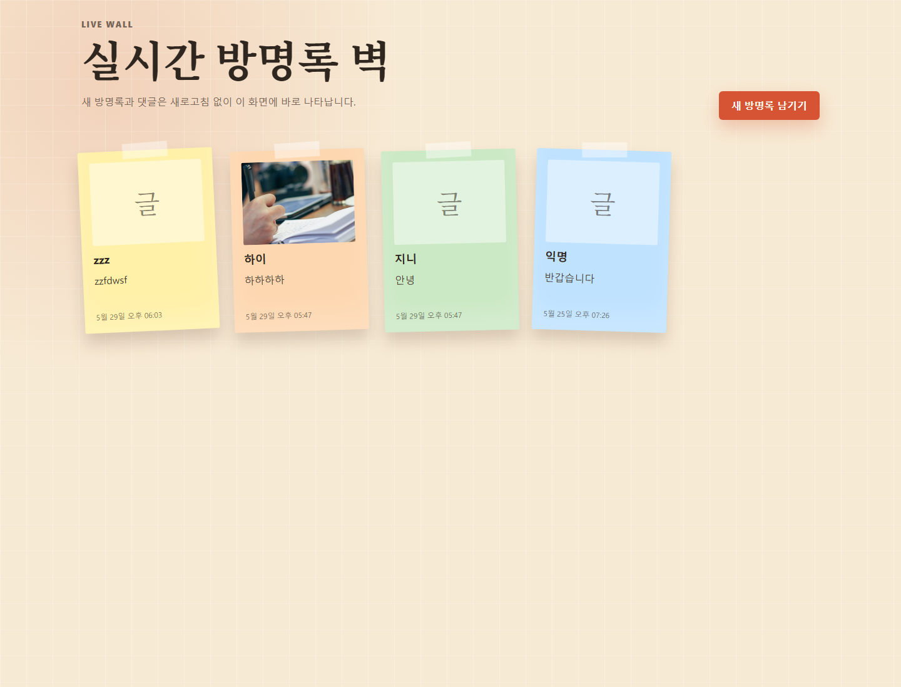

# Realtime Guestbook

[English](README.md) | [한국어](README.ko.md) | [日本語](README.ja.md)



A digital guestbook where visitors upload a photo or draw on a canvas, leave a short message, and see new post-it notes and comments appear in real time on a shared wall.

## Product intent

The project targets events, exhibitions, meetups, and classes where many people want to leave lightweight visual messages from their phones. It combines creation, media storage, a shared wall, detail views, and realtime conversation in one responsive MVP.

## Screens

### Create an entry



### Shared realtime wall



## Core capabilities

- Photo upload or in-browser canvas drawing
- Name or nickname and short message input
- Image persistence in Supabase Storage
- Guestbook post persistence in Supabase Postgres
- Post-it style cards on `/wall`
- Realtime insertion of new guestbook entries
- Detail modal with a realtime comment thread
- Mobile and desktop responsive layouts
- Input validation, loading states, actionable errors, and Escape-to-close modal behavior

## Technology

- React 19
- TypeScript
- Vite 7
- React Router 7
- Supabase Postgres, Storage, and Realtime
- Vitest and Testing Library
- ESLint

## Architecture

```text
Create page (/)
  ├─ photo upload or canvas export
  ├─ Supabase Storage: guestbook-media/posts/*
  └─ Supabase Postgres: guestbook
            │
            └─ Realtime INSERT subscription
                         │
Shared wall (/wall) ── post detail ── comments + Realtime
```

Realtime rows are merged by `id` to prevent duplicates, and subscriptions are removed when the relevant component unmounts.

## Project structure

```text
src/
  components/
    DrawingCanvas.tsx
    PhotoUploader.tsx
    PostDetailModal.tsx
    PostItCard.tsx
  lib/
    guestbook.ts
    supabase.ts
    upload.ts
  pages/
    HomePage.tsx
    WallPage.tsx
  types.ts
supabase/
  schema.sql
docs/
  thumbnail.svg
  screenshots/
```

## Run locally

```powershell
npm install
Copy-Item .env.example .env.local
npm run dev
```

Set the Supabase project values in `.env.local`:

```env
VITE_SUPABASE_URL=https://your-project-ref.supabase.co
VITE_SUPABASE_ANON_KEY=your-supabase-anon-key
```

Use the project root URL for `VITE_SUPABASE_URL`; do not append `/rest/v1`.

## Supabase setup

Run [supabase/schema.sql](supabase/schema.sql) in the Supabase SQL Editor. The schema:

- extends the existing `public.guestbook` table
- creates or aligns `public.comments`
- adds indexes for creation time and comment lookup
- enables MVP read/insert RLS policies
- creates the public `guestbook-media` bucket
- allows anonymous upload/read under the `posts/` prefix
- enables Realtime for `guestbook` and `comments`

| Resource | Responsibility |
| --- | --- |
| `guestbook` | Guestbook posts |
| `comments` | Comments linked by `post_id` |
| `guestbook-media` | Uploaded photos and canvas drawings |

## Verification

```powershell
npm test
npm run lint
npm run build
```

Manual checks should cover text-only, photo, and drawing posts; realtime wall updates in two tabs; realtime comments; modal keyboard behavior; and mobile touch drawing.

## Deployment

The repository is ready for a Vite deployment on Vercel. Configure `VITE_SUPABASE_URL` and `VITE_SUPABASE_ANON_KEY`, use `npm run build`, and publish the `dist` directory.

## Security and current limitations

The MVP intentionally allows anonymous public writes. Before using it for a public event or production service, add authentication where appropriate, rate limiting, moderation and spam controls, upload size/type enforcement, stricter Storage policies, and operational monitoring. The public anon key is designed for browser use, but security depends on correct RLS and Storage policies; never expose the Supabase service-role key.
